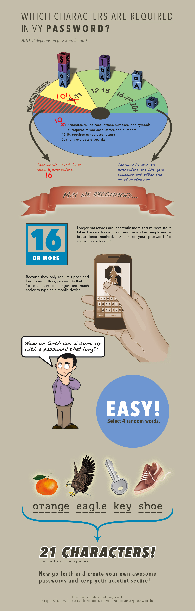

Passphrase Policy
=================

This module provides a way to enforce restrictions on user passwords by
defining a password policy that encourages the use of pass phrases.

The password constraints are pre-defined and must be met before a user
password change will be accepted. Each constraint has a parameter
allowing for the minimum number of valid conditions which must be met before
the constraint is satisfied.

The password rules follow the model from Stanford University's IT department.
Stanford recommends "pass phrases" instead of passwords. Pass phrases are
longer, but easier to remember than complex passwords, and if well-chosen
can provide better protection against hackers.

Stanford's password rules change based on password length:

* 8-11: mixed case letters, numbers, & symbols
* 12-15: mixed case letters & numbers
* 16-19: mixed case letters
* 20+: no restrictions

It must not be equal to your previous password or contain your username.

The rules are compliant with PCI-DSS v3.2, 8.2.3 and NIST SP 800-63-2.

Usage
-----

Enable the module for full functionality. There is no configuration.

Having no configuration is intentional because it prevents users from altering
the password rules when they're annoyed by them. Disabling the module logs
a high level alert for administrators to review.

Limitations
-----------

* Password policies only apply to passwords set via user forms in the web
  interface. Passwords changed by other means (commandline, web services, etc.)
  will not be subject to password policy constraints.

* Consider encouraging (or requiring as an organizational policy) users to use
  a password manager to generate and store strong, per-site passwords:
    https://en.wikipedia.org/wiki/List_of_password_managers

Current Maintainer
------------------

* David Norman (https://github.com/deekayen)

Credits
-------

* Drupal 4.7 version of Password Policy was written by David Ayre (https://www.drupal.org/user/67245)
* Refactored and maintained by Miglius Alaburda (https://www.drupal.org/user/18741)
* Edited over the years by a ton of people (https://www.drupal.org/node/85872/committers)
* Password rules by Stanford University IT (https://uit.stanford.edu/service/accounts/passwords)
* Selected parts ported to Backdrop as a renamed module by David Norman (https://github.com/deekayen)
